# Privacy-Preserving Human Presence and Motion Detection Using Wi-Fi CSI

**Camera-free detection of room occupancy and human motion using three ESP32-S3 boards, Wi-Fi Channel State Information (CSI) and lightweight machine learning.**

[](https://docs.espressif.com/projects/esp-idf/en/v5.5/esp32s3/)
[](https://www.python.org/)
[](https://scikit-learn.org/)

> Final project of **EEE 416: Microprocessor and Embedded Systems Laboratory** (January 2026), Department of Electrical and Electronic Engineering, Bangladesh University of Engineering and Technology (BUET). Section B1, Group 06.

<!-- Demo video: add your YouTube link here, e.g. [Watch the demo](https://youtu.be/XXXX) -->

<p align="center">
  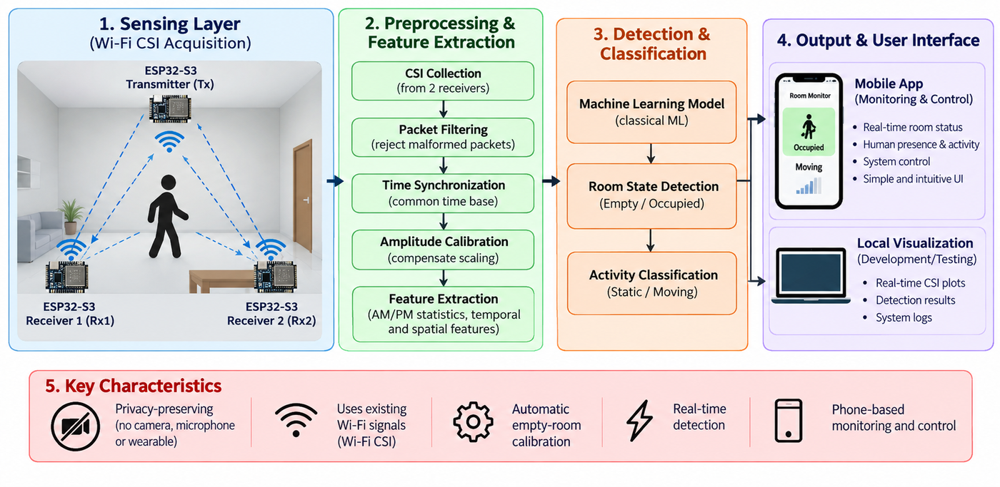
</p>

## Highlights

- **Privacy-preserving by design.** The final detector uses no camera, microphone or wearable. It only measures how a person changes the Wi-Fi channel between a transmitter and two receivers.
- **Low-cost hardware.** One ESP32-S3 transmitter and two ESP32-S3 receivers on a dedicated 2.4 GHz link (channel 6, 20 MHz), about 50 CSI packets per second per receiver.
- **Two-stage detection.** Phase 1 decides **EMPTY** or **PERSON**. Phase 2 decides whether the person is **STATIC** or **MOVING**.
- **Tested on an unseen person.** On a held-out subject, presence detection reaches **99.82%** window accuracy and the three-state cascade reaches **93.14%**.
- **Live operation.** A 12-second empty-room calibration at start-up, five-window majority voting and a phone-browser dashboard with START and STOP.
- **Open, reproducible data.** 39 recording sessions, 78 raw CSV files and 227,505 CSI packets, together with the processed feature tables and trained models.

## Contents

1. [Overview](#1-overview)
2. [Results at a glance](#2-results-at-a-glance)
3. [System architecture](#3-system-architecture)
4. [Hardware](#4-hardware)
5. [Firmware](#5-firmware)
6. [Dataset](#6-dataset)
7. [Signal processing](#7-signal-processing)
8. [Phase 1: presence detection](#8-phase-1-presence-detection)
9. [Phase 2: motion detection](#9-phase-2-motion-detection)
10. [Live system and phone dashboard](#10-live-system-and-phone-dashboard)
11. [Repository structure](#11-repository-structure)
12. [Getting started](#12-getting-started)
13. [Troubleshooting](#13-troubleshooting)
14. [What did not work: 3D pose estimation](#14-what-did-not-work-3d-pose-estimation)
15. [Limitations and future work](#15-limitations-and-future-work)
16. [Ethics, privacy and security](#16-ethics-privacy-and-security)
17. [Team](#17-team)
18. [References](#18-references)
19. [Contact and citation](#19-contact-and-citation)

---

## 1. Overview

Room-occupancy information is useful for automation, space management and non-intrusive monitoring. A useful detector must recognise a motionless occupant as well as a moving one, without asking anyone to wear a device. Each common sensor has a trade-off:

| Approach | Useful property | Main trade-off |
| --- | --- | --- |
| Camera | Detailed visual scene information | Records identifiable appearance; depends on view and lighting |
| PIR sensor | Simple and inexpensive | Little evidence of a person who is not moving |
| Wearable | Measurements tied to the wearer | Must be worn and powered |
| Dedicated radar | Purpose-built radio sensing | Requires separate RF sensing hardware |
| **Wi-Fi CSI (this project)** | **Device-free channel measurements, no images** | Depends on geometry, calibration and a stable environment |

Wi-Fi **Channel State Information** describes how the radio channel changes the signal on each subcarrier between a transmitter and a receiver. A human body changes propagation through attenuation, reflection and scattering. A person who stands still changes the channel *profile* compared with the empty room, while a person who walks makes the channel *fluctuate over time*. This project therefore combines two kinds of evidence:

- **Phase 1 (presence):** how far the current CSI profile deviates from an empty-room baseline → **EMPTY / PERSON**.
- **Phase 2 (motion):** how quickly the CSI changes within a two-second window → **STATIC / MOVING**, shown only when Phase 1 reports PERSON.

## 2. Results at a glance

All numbers below are **offline** results on windows from a subject who was never used for training or model selection (subject **S03**). The live dashboard's accuracy was not separately measured. The complete analysis will be in the project report ([`docs/report/`](docs/report/), to be added).

| Task | Model | Validation (subject S02) | Held-out test (subject S03) |
| --- | --- | --- | --- |
| Phase 1: EMPTY vs PERSON | Single-feature threshold (baseline) | 93.20% accuracy, macro-F1 0.9100 | – |
| Phase 1: EMPTY vs PERSON | Logistic regression | 99.72% accuracy, macro-F1 0.9960 | – |
| Phase 1: EMPTY vs PERSON | **Random forest (selected)** | 99.91% accuracy, macro-F1 0.9987 | **99.82% accuracy, macro-F1 0.9973, PERSON recall 100%** |
| Phase 2: EMPTY / STATIC / MOVING | **Cascade: presence RF → motion RF (deployed)** | 96.94% accuracy, macro-F1 0.9741 | **93.14% accuracy, macro-F1 0.9421** |
| Phase 2: EMPTY / STATIC / MOVING | Direct three-class logistic regression | 98.60% accuracy, macro-F1 0.9856 | 91.98% accuracy, macro-F1 0.9227 |

- When each test recording is labelled by its most frequent window prediction, **every test session is classified correctly** (9/9 in Phase 1, 10/10 in Phase 2 for both models).
- Validation preferred the direct model, but on the unseen subject the cascade generalised better (accuracy dropped 3.80 points from validation, against 6.61 points for the direct model). The cascade is also the one used by the live system.
- The main remaining weakness is the STATIC/MOVING boundary. In the cascade, 65 STATIC windows were called MOVING, and 56 of them come from one recording, `S03_stand_center` (65 of its 121 windows correct, 53.72%).

<p align="center">
  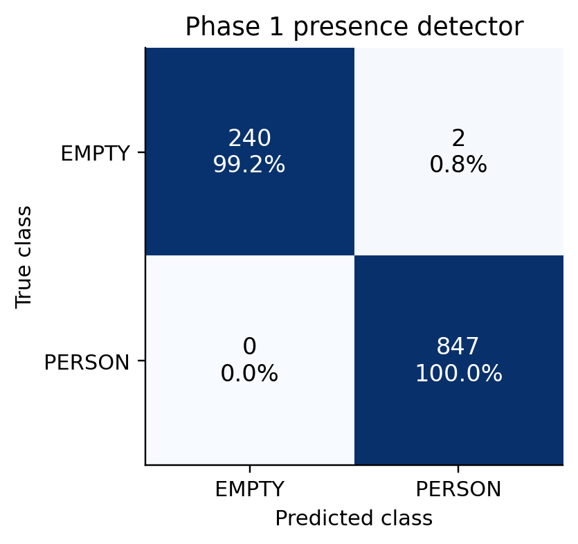
  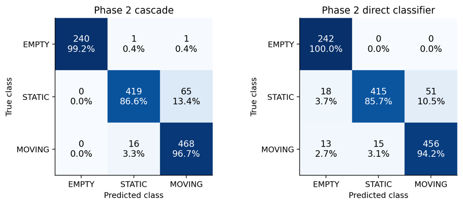
</p>
<p align="center">
  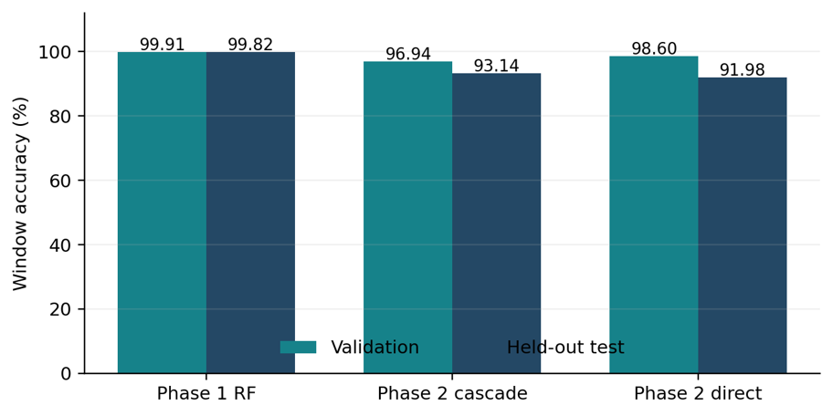
  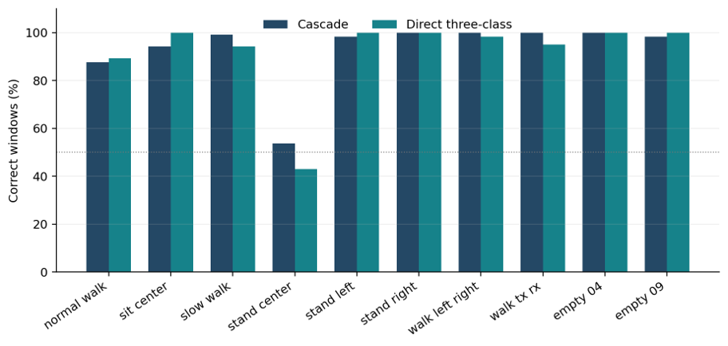
</p>

## 3. System architecture

<p align="center">
  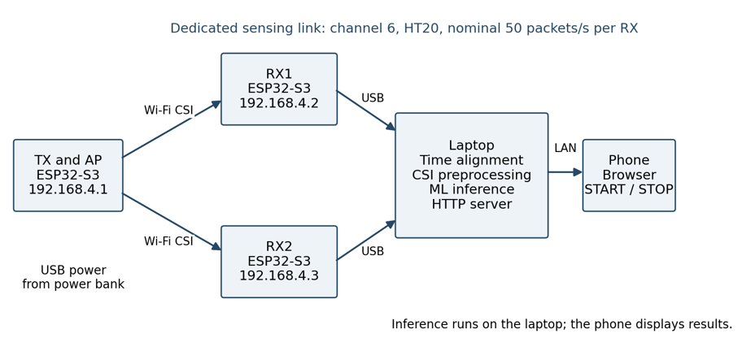
</p>

| Block | Role |
| --- | --- |
| **TX** (ESP32-S3) | WPA2 soft-AP on channel 6, 20 MHz (`192.168.4.1`). Sends a 256-byte UDP packet to RX1 and RX2 (port 3333) every 20 ms. Powered by a power bank. |
| **RX1, RX2** (ESP32-S3) | Join the TX network (`192.168.4.2`, `192.168.4.3`) with Wi-Fi power saving disabled. Capture the CSI of every 802.11n packet from the TX and stream one text line per packet over USB serial at 921,600 baud. |
| **Laptop** (Python) | Reads both receivers in parallel and timestamps every line on one shared clock. Preprocesses the data, extracts features, runs the random-forest models and serves the dashboard. |
| **Phone** (any browser) | Opens `http://<laptop-IP>:8080` on the same local network to see the live state and press START or STOP. |

## 4. Hardware

| Item | Qty | Unit cost (BDT) | Subtotal (BDT) |
| --- | --- | --- | --- |
| ESP32-S3 development board (TX, RX1, RX2) | 3 | 750 | 2,250 |
| Data-capable USB cable | 3 | 150 | 450 |
| Non-metal enclosure / stand allowance | 3 | 250 | 750 |
| Labels, cable ties and spare parts | 1 | 300 | 300 |
| Laptop / host computer | reused | 0 | 0 |
| Smartphone for monitoring | reused | 0 | 0 |
| Power bank for the transmitter | reused | 0 | 0 |
| **Total estimated prototype cost** | | | **3,750** |

<p align="center">
  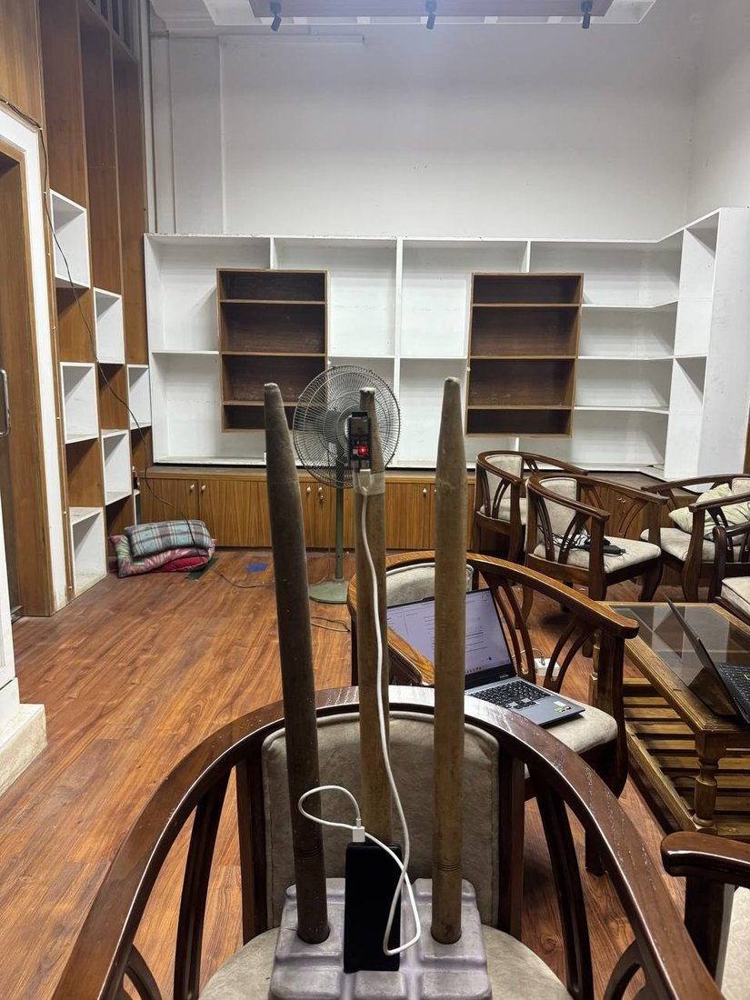
  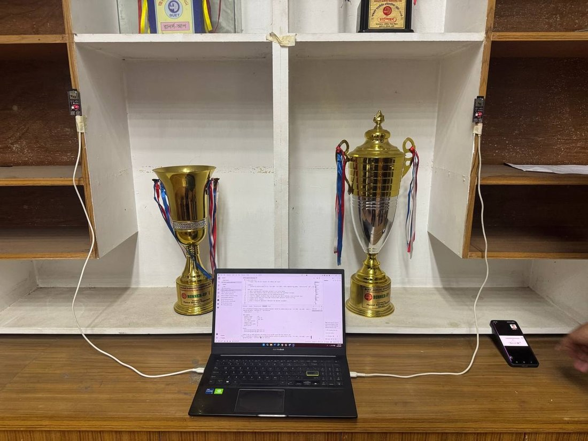
</p>
<p align="center">
  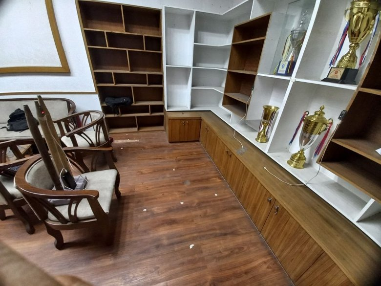
  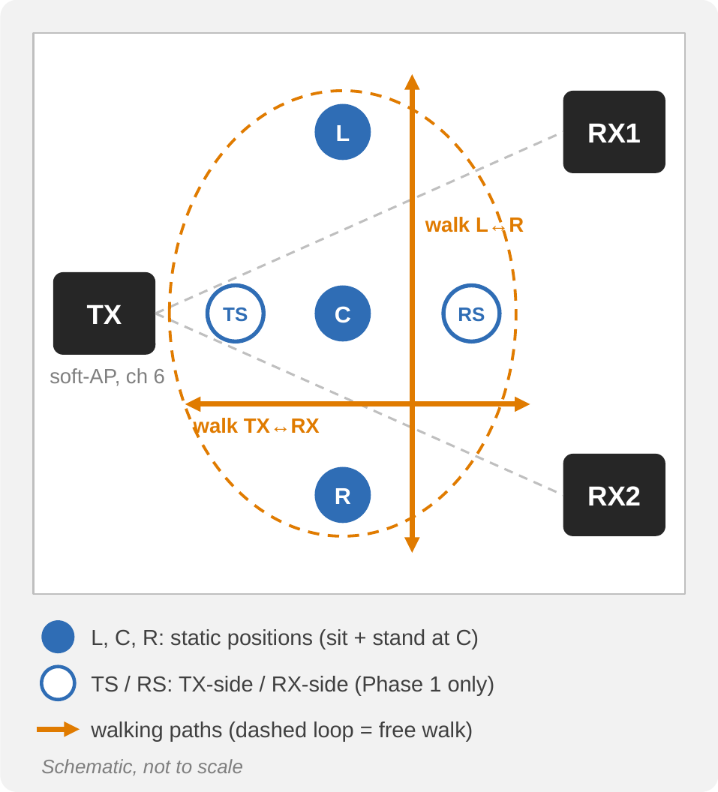
</p>

The transmitter stands on a pole in the room and faces the receivers, which are taped to the sides of a shelf on the opposite wall. Five standing positions are marked on the floor:
- **TS** (TX side), **C** (centre) and **RS** (RX side) lie on the line from the transmitter to the receivers.
- **L** and **R** cross that line at the centre.

The boards were never moved between recording sessions.

## 5. Firmware

The firmware is written in C on **ESP-IDF 5.5.5** (FreeRTOS) and lives in [`phase1/firmware/`](phase1/firmware/).

| Project | Role |
| --- | --- |
| [`tx/`](phase1/firmware/tx/) | Soft-AP + UDP sender (dual unicast, 20 ms interval, 256-byte payload) |
| [`rx1/`](phase1/firmware/rx1/) | CSI receiver, fixed IP `192.168.4.2` |
| [`rx2/`](phase1/firmware/rx2/) | Same code as RX1 with IP `192.168.4.3` |

**CSI configuration** (`csi_receiver.c`):

```c
wifi_csi_config_t config = {
    .lltf_en = true,
    .htltf_en = true,
    .stbc_htltf2_en = true,
    .ltf_merge_en = true,
    .channel_filter_en = true,
    .manu_scale = false,
    .shift = false,
};
```

- **Filtering:** the receiver keeps CSI only from packets sent by the TX's MAC address and only from 802.11n (HT) packets (`sig_mode == 1`), so every line has the same 256-byte layout.
- **Non-blocking export:** the CSI callback only copies each packet into a 128-slot FreeRTOS queue, and a separate task prints it. Wi-Fi never waits for the USB link, and any dropped packet is counted.

**Serial line format**, one line per packet (the laptop adds `pc_monotonic_ns` and `pc_elapsed_s`):

```text
CSI_DATA,seq,timestamp_us,rssi,noise_floor,channel,secondary_channel,sig_mode,mcs,cwb,stbc,len,first_word_invalid,dropped,"[256 numbers]"
```

**Throughput correction.** The first firmware broadcast a packet every 5 ms. Broadcast frames are sent in the legacy format, so each packet gave only 128 CSI numbers (LLTF only). The rate of 200 lines per second was also more text than the serial link could carry, and receivers repeatedly printed `Disconnected. Reconnecting...`. The final firmware made three changes:
- It switched to **dual unicast**, which gives full 802.11n packets with 256 numbers (LLTF + HT-LTF).
- It raised the interval to **20 ms**.
- It added the **queue and separate print task** described above.

| Configuration | Text per receiver | Share of a 921,600-baud link (≈ 92 kB/s) |
| --- | --- | --- |
| 5 ms, full 256-number lines | ≈ 164 kB/s | ≈ 178% (overload) |
| **20 ms, final firmware** | **≈ 41 kB/s** | **≈ 45%** |

The 78 recordings ran at 41.67–50.02 packets per second with no firmware-reported drops.

<p align="center">
  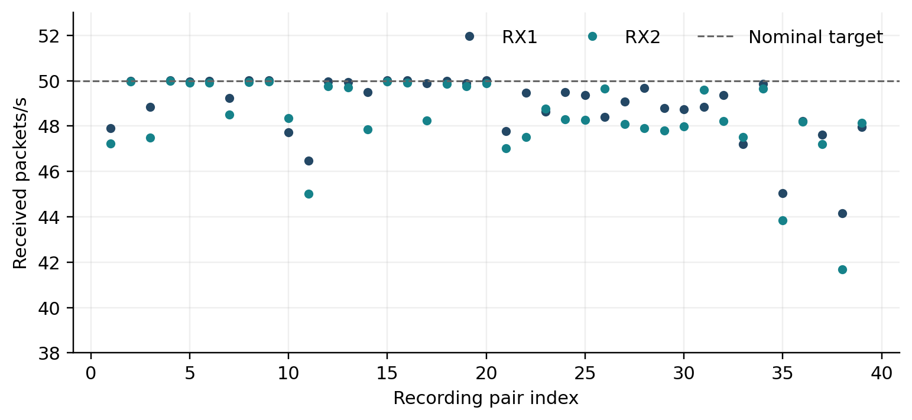
</p>

> **Wi-Fi credentials.** For this public repository the network name and password are placeholders (`CSI_SENSOR_AP` / `change_this_password`). Set your own values in `tx/main/wifi_ap.c`, `rx1/main/wifi_sta.c` and `rx2/main/wifi_sta.c` before flashing, and keep them identical on all three boards.

## 6. Dataset

Every session is about 60 seconds long and is recorded by **both receivers at the same time**, giving one CSV file per receiver. Raw data is in [`phase1/data/raw/`](phase1/data/raw/) and [`phase2/data/raw_new/`](phase2/data/raw_new/).

| Scenario (file label) | Type | S01 | S02 | S03 | Used in |
| --- | --- | :---: | :---: | :---: | --- |
| `empty_01` … `empty_09` | EMPTY | 9 sessions, nobody in the room | | | Phase 1 + 2 |
| `stand_center`, `stand_left`, `stand_right`, `sit_center` | STATIC | ✓ | ✓ | ✓ | Phase 1 + 2 |
| `stand_txside`, `stand_rxside` | STATIC | ✓ | ✓ | ✓ | Phase 1 |
| `normal_walk` | MOVING | ✓ | ✓ | ✓ | Phase 1 + 2 |
| `slow_walk`, `walk_left_right`, `walk_tx_rx` | MOVING | ✓ | ✓ | ✓ | Phase 2 |

- **Totals:** 39 sessions × 2 receivers = **78 CSV files**, **227,505 CSI packets**, about 39 minutes per receiver.
- **Naming:** `S02_stand_right_RX1.csv` = subject S02, standing on the right marker, receiver 1.
- **Subject-wise split:** S01 → train, S02 → validation, S03 → untouched test. Empty sessions are split 5 / 2 / 2.
- **Quality checks:** every file was checked for duration, packet rate, gaps, lost packets and packet format (channel 6, 20 MHz, HT, 256-byte CSI). All 78 passed.

Each CSV has 16 columns. The first two come from the laptop; the rest come from the receiver firmware.

| Column | Meaning |
| --- | --- |
| `pc_monotonic_ns`, `pc_elapsed_s` | Laptop clock at arrival; seconds since the recording started (shared by RX1 and RX2) |
| `seq`, `device_timestamp_us` | Receiver packet counter (a gap means a drop inside the RX); ESP32 clock at reception |
| `rssi`, `noise_floor` | Signal strength and radio noise floor (dBm) |
| `channel`, `secondary_channel`, `sig_mode`, `mcs`, `cwb`, `stbc` | Packet format: channel 6, no 40 MHz extension, 802.11n, MCS index, 20 MHz, no STBC |
| `csi_len`, `first_word_invalid`, `firmware_dropped` | 256 bytes of CSI; ESP-IDF validity flag; packets dropped in the RX so far |
| `csi_data` | 256 signed numbers = 128 (imaginary, real) pairs: 64 LLTF subcarrier slots followed by 64 HT-LTF slots |

## 7. Signal processing

The same functions ([`phase1/presence/csi_utils.py`](phase1/presence/csi_utils.py)) build the dataset and run in the live system.

1. **Check and load:** keep 256-byte, 20 MHz, channel-6 HT packets and sort them by laptop time.
2. **Amplitude:** convert each (I, Q) pair to |H| and keep **107 active subcarriers** (51 LLTF + 56 HT-LTF). Guard bands, DC and the possibly-invalid first LLTF word are removed.
3. **Align RX1/RX2:** linearly interpolate both receivers onto one shared **25 Hz** grid over their overlapping time. Any gap longer than 0.25 s is rejected.
4. **Normalise:** divide the LLTF and the HT-LTF part of every packet by its own median amplitude. This removes gain changes and the ≈ 4× scale difference between the two fields.
5. **Smooth:** apply a Savitzky–Golay filter (5 samples, order 2) along time.
6. **Window:** cut 2-second windows (50 samples) with a 0.48 s offline hop, giving 121 windows per session.

The amplitude of subcarrier *k* and the field-wise normalisation are:

$$|H_k(t)| = \sqrt{I_k(t)^2 + Q_k(t)^2}, \qquad \tilde{A}_k(t) = \frac{|H_k(t)|}{\operatorname{median}_{j \in F(k)} |H_j(t)|}$$

where *F(k)* is the set of retained subcarriers in the same training field (LLTF or HT-LTF) as *k*.

<p align="center">
  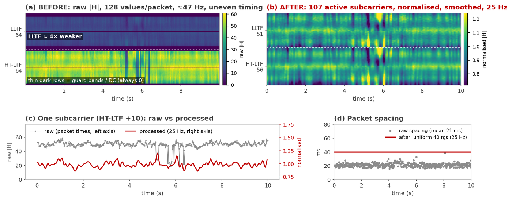
</p>

The figure shows a real RX1 recording of subject S01 walking between TX and RX (seconds 20–30):
- **(a)** raw amplitudes;
- **(b)** after preprocessing;
- **(c)** one subcarrier before and after;
- **(d)** packet spacing before and after resampling.

Walking produces strong, fast fluctuations across all subcarriers, while an empty room and a still person look similar in temporal variation:

<p align="center">
  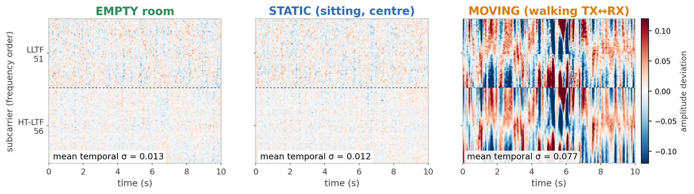
</p>

## 8. Phase 1: presence detection

- **Empty-room baseline:** a median CSI profile per receiver, built from the five training EMPTY sessions (median over time, then median across sessions). In live use, a new baseline is measured during the 12-second start-up calibration.
- **31 features per window:** 13 per receiver and 5 across receivers. They describe the average spectral shape, temporal variation, sample-to-sample change, and deviation from the empty baseline (absolute difference, RMSE and profile correlation).
- **Models compared on validation:**
  - a single-feature threshold (average absolute baseline deviation ≥ 0.022511673);
  - logistic regression (standardised, C = 1, balanced classes);
  - a random forest (300 trees, max depth 5, balanced classes).
- **Selection:** the random forest is selected on validation and tested once on S03. It got 1,087 of 1,089 test windows right; the two errors are EMPTY windows from `empty_09`.

Pipeline: [`phase1/python/`](phase1/python/) (capture → validate → prepare → train → evaluate → live).

## 9. Phase 2: motion detection

<p align="center">
  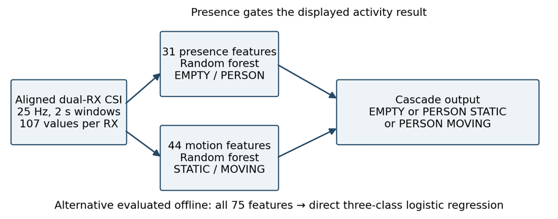
</p>

- **44 motion features per window:** 18 per receiver and 8 across receivers. They cover temporal standard deviation, mean and RMS sample differences, peak-to-peak range, packet-to-packet change and 0.5–5 Hz band power from an FFT. None of them needs the empty-room baseline.
- **Cascade (deployed):** the Phase 1 presence model decides EMPTY/PERSON. For PERSON windows, a motion random forest (400 trees, max depth 7, trained on STATIC and MOVING windows only) decides STATIC/MOVING.
- **Direct alternative:** one logistic-regression model on all 75 features (31 + 44) predicts the three classes at once.
- **Selection rule:** validation macro-F1, with balanced accuracy as the tie-break. The test subject is used exactly once.

**Why the cascade is deployed:**
- It generalised better to the unseen subject.
- Its presence stage uses the live start-up baseline, whereas the direct model is tied to the training baseline.

The stand-centre failure has several possible explanations: small unlabelled movements, body orientation, or a location-dependent channel response. The available labels cannot separate these.

Pipeline: [`phase2/python/`](phase2/python/).

## 10. Live system and phone dashboard

<p align="center">
  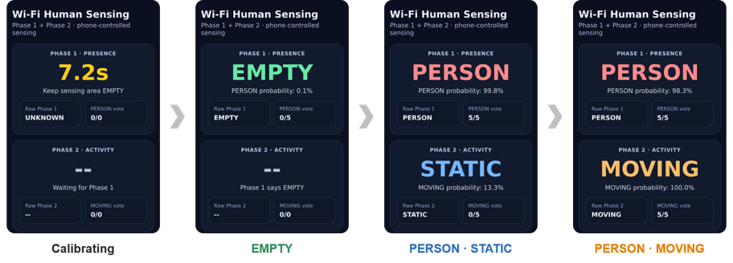
</p>

1. **START** in the phone browser starts a 5-second countdown, during which the operator leaves the sensing area.
2. A **12-second EMPTY calibration** measures today's empty-room baseline. Both streams are checked for coverage and gaps, and drift from the training baseline is reported.
3. Every 0.5 s (requested) the newest 2-second window is classified:
   - **Phase 1** gives P(person) ≥ 0.5, with a majority vote over the last five windows.
   - **Phase 2** gives P(moving) ≥ 0.5 for every window whose raw Phase 1 decision is PERSON, with its own vote. The two votes run in parallel, so there is no cascade delay.
4. STATIC or MOVING is shown only while the stable Phase 1 state is PERSON. A stream that is silent for more than 1 s, or a gap over 0.25 s, makes the system wait instead of guessing.
5. **STOP** ends operation at any time.

The dashboard is a small HTTP server on the laptop (default `0.0.0.0:8080`) that the phone polls every 250 ms.

## 11. Repository structure

```text
.
├── README.md                  ← you are here
├── CITATION.cff · requirements.txt · .gitignore
├── docs/
│   ├── images/                figures used in this README
│   ├── report/                project report (to be added)
│   ├── poster/                project poster (to be added)
│   └── presentation/          final presentation (to be added)
├── phase1/                    hardware, firmware, Phase 1 (EMPTY / PERSON)
│   ├── firmware/
│   │   ├── tx/                ESP-IDF project: access point + UDP sender
│   │   ├── rx1/               ESP-IDF project: CSI receiver 1
│   │   └── rx2/               ESP-IDF project: CSI receiver 2
│   ├── presence/csi_utils.py  shared CSI decoding, alignment, normalisation, features
│   ├── python/                00–08 scripts: capture, QC, dataset, training, test, live, phone
│   ├── data/                  manifest.csv, raw/ (60 CSV files), processed/ (features)
│   ├── models/                presence_model.joblib and selection records
│   └── reports/               test results and sanity plot
└── phase2/                    Phase 2 (EMPTY / STATIC / MOVING) and the final phone app
    ├── python/                00–08 scripts incl. 08_phase2_phone_control_FINAL_NO_CASCADE_LAG.py
    ├── data/                  manifest.csv, raw_new/ (18 CSV files), processed/ (features)
    ├── models/                motion_model.joblib, direct3_model.joblib, selection record
    └── reports/               new-data QC and test results
```

Every folder has its own `README.md` explaining its contents.

## 12. Getting started

### 12.1 Requirements

- **Hardware:** three ESP32-S3 development boards, data-capable USB cables, a power bank or USB charger for the TX, a laptop, and optionally a phone.
- **Firmware toolchain:** [ESP-IDF 5.5.x](https://docs.espressif.com/projects/esp-idf/en/v5.5/esp32s3/get-started/) (we used 5.5.5, with the VS Code ESP-IDF extension).
- **Python:** 3.12 or newer.

### 12.2 Python environment

```bash
git clone <this-repository-url>
cd <repository-folder>
python -m venv .venv
# Windows: .venv\Scripts\activate      macOS/Linux: source .venv/bin/activate
pip install -r requirements.txt
python phase1/python/00_list_ports.py      # lists the serial ports of the connected boards
```

> The saved `.joblib` models were trained with **scikit-learn 1.9.0**, so keep that version to load them reliably. With another version, retrain from the feature tables using the commands in 12.6.

### 12.3 Build and flash the firmware

1. Set the same Wi-Fi name and password in the three firmware projects (see the note in [Firmware](#5-firmware)).
2. In an ESP-IDF terminal, build and flash each project separately, using the port of the board you are flashing (`COM6` is only an example):

```bash
cd phase1/firmware/tx      # then rx1, then rx2
idf.py build
idf.py -p COM6 flash
idf.py -p COM6 monitor     # check the logs, then exit with Ctrl+]
```

The included `sdkconfig` files already select the ESP32-S3 target, enable Wi-Fi CSI and set the receiver console to 921,600 baud. A healthy receiver log shows `CSI enabled successfully`, followed by streaming `CSI_DATA` lines.

### 12.4 Run the live demo (final system)

From the repository root, with RX1 and RX2 connected over USB (replace the ports):

```bash
python phase2/python/08_phase2_phone_control_FINAL_NO_CASCADE_LAG.py --rx1 COM6 --rx2 COM8 --presence-model phase1/models/presence_model.joblib --motion-model phase2/models/motion_model.joblib --training-baseline phase1/data/processed/empty_baseline.npz --host 0.0.0.0 --port 8080
```

1. Open `http://<laptop-IP>:8080` on a phone that can reach the laptop on the local network. Allow Python through the firewall on private networks if asked.
2. Press **START OPERATION** and leave the area before the countdown ends. Keep it empty during the 12-second calibration.
3. Walk in, stand, sit and walk. The dashboard shows PERSON and STATIC/MOVING, plus packet counters for both receivers.
4. Press **STOP OPERATION** before moving any board. Recalibrate after any change to the room or the placement.

Phase-1-only alternatives (run from `phase1/`): `python python/07_live_presence.py ...` in the terminal, or `python python/08_phase6_phone_control_integrated.py ...` with the phone.

### 12.5 Record a new session

From `phase1/`:

```bash
python python/01_capture_dual_rx.py --rx1 COM6 --rx2 COM8 --label S04_stand_center --duration 60 --countdown 5 --out data/raw
python python/02_validate_capture.py --rx1 data/raw/S04_stand_center_RX1.csv --rx2 data/raw/S04_stand_center_RX2.csv
```

Use a unique label for every session, keep the RX1/RX2 pair together, and never append recordings into one CSV. New sessions only enter a dataset when they are added to a `manifest.csv`. The Phase 2 walking sessions were recorded with [`phase2/01_collect_phase2.ps1`](phase2/01_collect_phase2.ps1).

### 12.6 Reproduce the datasets, models and test results

**Phase 1**, run from `phase1/`:

```bash
python python/04_prepare_dataset.py --manifest data/manifest.csv --out data/processed --fs 25 --window 2.0 --step 0.5
python python/05a_threshold_baseline.py --train data/processed/train_features.csv --val data/processed/val_features.csv --out models/threshold_baseline.json
python python/05_train_presence.py --train data/processed/train_features.csv --val data/processed/val_features.csv --metadata data/processed/metadata.json --outdir models
python python/06_evaluate_test.py --test data/processed/test_features.csv --model models/presence_model.joblib --out reports/test_results.json
```

**Phase 2**, run from `phase2/python/`:

```bash
python 02_validate_phase2_new.py --raw ../data/raw_new --out ../reports/new_data_qc.csv
python 03_prepare_phase2_dataset.py --manifest ../data/manifest.csv --out ../data/processed --fs 25 --window 2.0 --step 0.5
python 04_train_phase2_models.py --train ../data/processed/train_features.csv --val ../data/processed/val_features.csv --metadata ../data/processed/metadata.json --presence-model ../../phase1/models/presence_model.joblib --outdir ../models
python 05_evaluate_phase2_test.py --test ../data/processed/test_features.csv --presence-model ../../phase1/models/presence_model.joblib --motion-model ../models/motion_model.joblib --direct-model ../models/direct3_model.joblib --selection ../models/phase2_model_selection.json --out ../reports/test_results_phase2.json
```

The test scripts are meant to be run **once** for a fixed model. Choosing or tuning a new model after looking at the S03 results would require a new, untouched test subject.

## 13. Troubleshooting

| Observation | Likely cause | Action |
| --- | --- | --- |
| Serial port will not open | Wrong port, or another program is using it | List ports; close other serial monitors or capture scripts |
| Board is powered but sends no serial data | Charge-only cable or wrong USB port | Use a data-capable cable and the board's correct port |
| Repeated `Disconnected. Reconnecting...` | TX power, credentials or traffic configuration | Check the AP connection and use the final 20 ms unicast firmware |
| One receiver counter stops | Cable disconnected, port error or receiver reset | Stop, restore the stream and recalibrate |
| Calibration fails | Area not empty, too little data or large gaps | Clear the area and check both streams |
| False presence after a room change | Baseline or geometry no longer representative | Restore the placement or run a new empty calibration |
| Phone cannot load the page | Network isolation, wrong laptop address or firewall | Check that the phone can reach the laptop on port 8080 |
| A label stays on screen during a waiting message | The last valid result is still displayed | Treat it as stale; check the receiver counters |

## 14. What did not work: 3D pose estimation

The first goal was to predict a full 17-joint 3D skeleton (51 coordinates) from dual-receiver CSI. Training labels came from video-based pose extraction (MediaPipe), paired with the CSI by timestamp. The predictions were unstable and often distorted, for several reasons:
- only three people were recorded;
- some video labels were noisy or missing;
- the CSI changes were not rich enough to reconstruct a skeleton reliably.

The project therefore narrowed its goal to the presence and motion detection above. The pose-estimation code and its video recordings are **not** part of this repository.

<p align="center">
  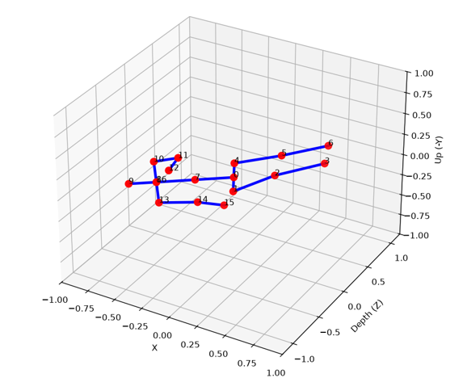
</p>

## 15. Limitations and future work

**Limitations**

- **Narrow evaluation:** one room, one device arrangement and three participants (one each for training, validation and testing).
- **Overlapping windows:** successive windows overlap by 76%, so the window count overstates the number of independent observations.
- **Processed CSI:** amplitude only. The firmware's LTF merging and channel filtering mean the exported values already include receiver-side processing.
- **Approximate timing:** host timestamps include serial and operating-system delays, so alignment is common-time resampling, not radio-clock synchronisation.
- **Bandwidth limits:** 25 Hz resampling limits the recoverable motion content, and 2-second windows limit frequency resolution to about 0.5 Hz.
- **Offline vs live:** offline and live processing differ slightly (smoothing scope, 0.48 s vs 0.5 s hop, start-up baseline). Live accuracy and latency were not measured separately.
- **No security:** the dashboard has no authentication or HTTPS and is intended for a controlled local network.

**Future work**

- **Broader data:** more participants, different days and rooms, changed device placements, and long stationary occupancy.
- **Live evaluation over time:** measured detection delay and false-alarm duration for entry, exit and start/stop events.
- **Single vs dual receiver:** trained and tested on the same splits, to quantify the value of the second receiver.
- **Richer activities:** walking direction (the TX↔RX and left↔right data already exists), falls, multiple people.
- **On-device inference** on the ESP32-S3, plus authentication, freshness indicators, an UNKNOWN state during faults, and proper packaging.

## 16. Ethics, privacy and security

- **Limited output:** the final system outputs only occupancy and coarse motion. It does not identify people or reconstruct appearance.
- **Participant codes:** participants appear only as codes (S01–S03).
- **Preliminary video:** video was used only in the earlier pose-estimation attempt, and that material is not published here.
- **Behaviour logs are personal data:** a movement log can reveal behaviour. Real use needs informed consent, limited access and limited retention.
- **Credentials:** the Wi-Fi credentials in this repository are placeholders. Never publish the real network password.
- **Honest reporting:** validation and test results are reported separately, including the failed pose attempt and the difficult stand-centre session.

> **Academic integrity.** This repository documents a graded course project. Students taking a similar course should follow their institution's academic-integrity rules and cite this work if they build on it.

## 17. Team

**Group B1-06**, EEE 416 (January 2026), Department of EEE, BUET

| Student ID | Name |
| --- | --- |
| 2106078 | **Tahmid Mahmud Fahim** |
| 2106080 | **Abid Uz Zaman** |
| 2106082 | **MD. Anayet Hossain Nayeem** |
| 2106083 | **Robayet Hossen Bapon** |

### Course Instructors

**Dr. Zabir Ahmed**<br>
Assistant Professor, Department of EEE, BUET

**Sadman Sakib Ahbab**<br>
Assistant Professor, Department of EEE, BUET

We sincerely thank our course instructors for their valuable guidance and support throughout this project.

## 18. References

1. F. Wang, S. Zhou, S. Panev, J. Han and D. Huang, "Person-in-WiFi: Fine-Grained Person Perception Using WiFi," *Proc. IEEE/CVF ICCV*, 2019, pp. 5452–5461. [Link](https://openaccess.thecvf.com/content_ICCV_2019/html/Wang_Person-in-WiFi_Fine-Grained_Person_Perception_Using_WiFi_ICCV_2019_paper.html)
2. K. Yan, F. Wang, B. Qian, H. Ding, J. Han and X. Wei, "Person-in-WiFi 3D: End-to-End Multi-Person 3D Pose Estimation with Wi-Fi," *Proc. IEEE/CVF CVPR*, 2024, pp. 969–978. [Link](https://openaccess.thecvf.com/content/CVPR2024/html/Yan_Person-in-WiFi_3D_End-to-End_Multi-Person_3D_Pose_Estimation_with_Wi-Fi_CVPR_2024_paper.html)
3. Espressif Systems, "Wi-Fi Driver: Wi-Fi Channel State Information," *ESP-IDF Programming Guide, ESP32-S3*. [Link](https://docs.espressif.com/projects/esp-idf/en/v5.5.1/esp32s3/api-guides/wifi.html)
4. Espressif Systems, "Start a Project," *ESP-IDF Programming Guide, ESP32-S3, v5.5*. [Link](https://docs.espressif.com/projects/esp-idf/en/v5.5/esp32s3/get-started/windows-start-project.html)
5. Google, "Pose landmark detection guide," *MediaPipe, Google AI Edge*. [Link](https://developers.google.com/edge/mediapipe/solutions/vision/pose_landmarker)
6. scikit-learn developers, "Common pitfalls and recommended practices." [Link](https://scikit-learn.org/stable/common_pitfalls.html)
7. scikit-learn developers, "RandomForestClassifier." [Link](https://scikit-learn.org/stable/modules/generated/sklearn.ensemble.RandomForestClassifier.html)
8. SciPy developers, "scipy.signal.savgol_filter." [Link](https://docs.scipy.org/doc/scipy/reference/generated/scipy.signal.savgol_filter.html)
9. Department of EEE, BUET, "EEE 416: Microprocessor and Embedded Systems Laboratory." [Link](https://eee.buet.ac.bd/academics/undergraduate/courses/eee416)

## 19. Contact and citation

This is an academic project and is not released under an open-source license. We are always open to collaboration. If you have any questions about the project, or would like to use or build on this work, feel free to email us:

- **Tahmid Mahmud Fahim**: [2106078@eee.buet.ac.bd](mailto:2106078@eee.buet.ac.bd)
- **Abid Uz Zaman**: [2106080@eee.buet.ac.bd](mailto:2106080@eee.buet.ac.bd)
- **MD. Anayet Hossain Nayeem**: [2106082@eee.buet.ac.bd](mailto:2106082@eee.buet.ac.bd)
- **Robayet Hossen Bapon**: [2106083@eee.buet.ac.bd](mailto:2106083@eee.buet.ac.bd)

If you refer to this work, please cite it. GitHub's **"Cite this repository"** button reads [`CITATION.cff`](CITATION.cff), or you can use:

```bibtex
@misc{groupb106_2026_wificsi,
  title        = {Privacy-Preserving Human Presence and Motion Detection Using Wi-Fi CSI},
  author       = {Fahim, Tahmid Mahmud and Zaman, Abid Uz and Nayeem, MD. Anayet Hossain and Bapon, Robayet Hossen},
  year         = {2026},
  howpublished = {GitHub repository},
  note         = {EEE 416 Final Project, Department of EEE, Bangladesh University of Engineering and Technology}
}
```
